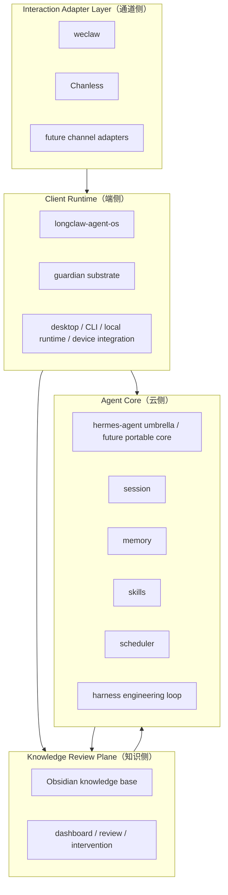
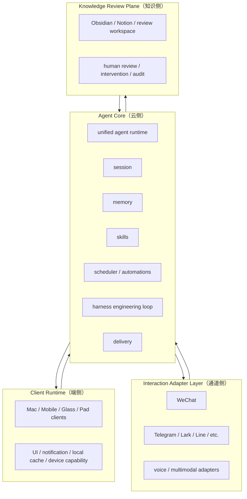

# Longclaw Architecture

This fork treats `hermes-agent` as the umbrella repository for the Longclaw product line.

The direction is deliberate:

- use the current local stack to validate product workflows and device-side integration
- keep upstream Hermes Agent as the runtime base
- converge toward a Hermes-like unified `Agent Core（云侧）`
- fold `harness` into a self-improving harness engineering loop instead of keeping it as a permanently separate top-level runtime

## Canonical Terms

- `Client Runtime（端侧）`
  - The user-device-side runtime and host environment.
  - Examples: macOS desktop app, local CLI, local launchd services, future mobile and glasses clients.
- `Agent Core（云侧）`
  - The portable agent runtime.
  - Responsible for `session / memory / skills / scheduler / learning loop`.
  - Usually cloud-hosted, but allowed to run locally in lightweight mode when needed.
- `Interaction Adapter Layer（通道侧）`
  - Message, voice, and protocol adapters.
  - Examples: WeChat, Telegram, Lark, Line, voice, multimodal adapters.
- `Knowledge Review Plane（知识侧）`
  - Human-readable knowledge projection, review, intervention, and audit.
  - Examples: Obsidian, Notion, dashboards, intervention queues, evidence trails.

## Architecture A

### `Local-first Reference Architecture（当前本地参考实现）`

Why this is the current shape:

- Longclaw still depends on device-local state: WeChat login, `launchd`, local toolchains, desktop notifications, and voice input.
- `longclaw-agent-os` is still the fastest way to validate product workflows end to end.
- `guardian` still matters because the current system is not yet a single unified runtime.

What it gets right:

- low migration risk
- fast iteration for a single-user system
- clear path for gradual extraction instead of a rewrite

What it does not solve:

- the core runtime is still spread across multiple repositories
- `watchdog / harness / learning` boundaries are transitional
- it is not the final distribution architecture

## Architecture B

### `Distributed Product Architecture（未来产品化架构）`

Why this is closer to upstream Hermes Agent:

- CLI, gateway, scheduling, memory, and session search can live in one runtime.
- hosting and long-running process control are more naturally delegated to cloud infrastructure
- the learning loop becomes a built-in runtime property, not an attached subsystem

Benefits:

- cleaner packaging for product distribution
- shared state across devices and channels
- easier multi-user and multi-tenant expansion

Costs:

- stronger need for explicit boundaries around device-local capabilities
- local recovery and desktop affordances must become thinner adapters
- the migration from the current stack is material, not cosmetic

## Harness Engineering Loop

In this fork, `Harness Engineering` means the improvement loop should become part of the core runtime:

1. ingest real sessions, traces, and outcomes
2. extract candidate memories, skills, and user-model updates
3. evaluate them against explicit harnesses and regression checks
4. promote only validated artifacts into active runtime state
5. surface conflicts, uncertainty, and risky actions to `Knowledge Review Plane（知识侧）`

This is the bridge between the current `harness` sub-system and the future unified `Agent Core（云侧）`.

## Current Direction

- keep `longclaw-agent-os` as the current `Client Runtime（端侧）` reference implementation
- use this `hermes-agent` fork as the umbrella repo and architecture source of truth
- move portable `watchdog / harness / learning` responsibilities into `Agent Core（云侧）`
- keep `weclaw` and `Chanless` as adapters, not product-core repositories

For the concrete repository mapping, see [REPO_MAP.md](REPO_MAP.md).
