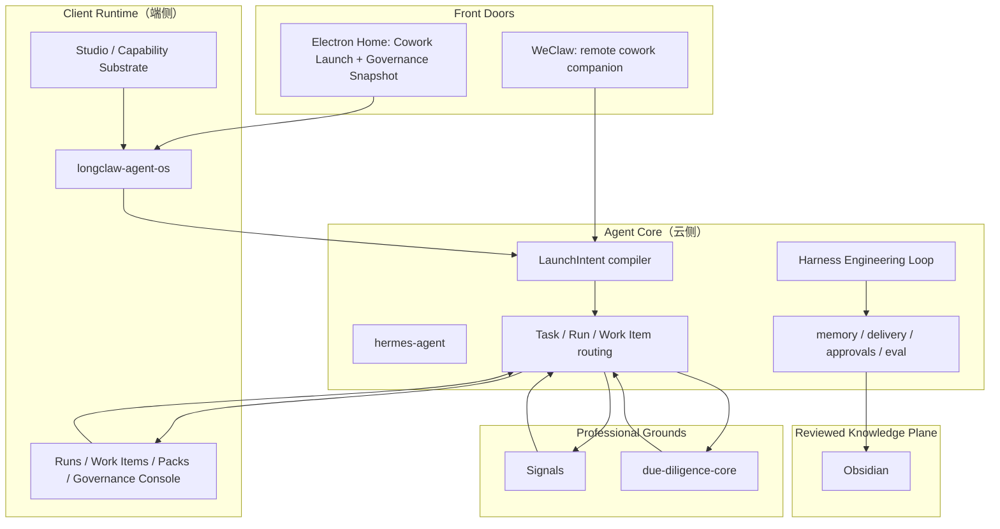

# Longclaw Architecture

This fork treats `hermes-agent` as the umbrella repository for the Longclaw product line.

Longclaw is not a pure governance console and not a chat-first cowork shell.
It is an Agent OS for a single high-leverage operator.

The product rule is:

- `Chat launches, console governs.`

## Product Positioning

Longclaw is built from two layers that must stay distinct but connected:

- `Cowork Front Door`
  - Launch work with natural language and `@plugin / @skill / @pack`.
  - Exists in `Electron Home` and `WeClaw`.
- `Governance Console`
  - Owns `runs / artifacts / evidence / review / work items / delivery / promotion`.
  - Lives primarily in `Electron`.

This keeps launch fluid while preserving explicit supervision, evidence, and review.

## Canonical Terms

- `Client Runtime（端侧）`
  - The user-device-side runtime and host environment.
  - In phase 1, this is also the default product home through `longclaw-agent-os`.
- `Agent Core（云侧）`
  - The portable runtime owned by `hermes-agent`.
  - Responsible for `session / memory / skills / scheduler / delivery / approvals / eval`.
- `Interaction Adapter Layer（通道侧）`
  - Channel adapters such as WeChat, voice, and future remote surfaces.
  - Adapters launch and relay; they do not own governance state.
- `Capability Substrate`
  - The curated capability layer exposed by the product shell.
  - Includes `skills / plugins / bundled skills / built-in plugins / cowork runtime`.
- `Professional Grounds`
  - Flagship specialist packs that build real depth through execution, evidence, review, and iteration.
  - In phase 1: `Signals` and `due-diligence-core`.
- `Reviewed Knowledge Plane`
  - Human-readable reviewed knowledge only.
  - In phase 1: `Obsidian`.
- `LaunchIntent`
  - The canonical front-door input compiled by Hermes into `Task / Run / Work Item`.
  - If the front door omits an explicit `@pack`, Hermes may still route canonically through
    a configured default launch pack/capability policy instead of forcing a local-only fallback.

## Current Product Promise

Longclaw's current promise is:

- cross-session memory
- typed launch through `@plugin / @skill / @pack`
- specialist pack orchestration
- reviewable evidence and work items
- reviewed knowledge promotion
- a `Harness Engineering Loop` that improves behavior from real usage

The key transport constraint remains:

- `weclaw / WeChat` is a `windowed proactive adapter`
- reliable today: ingress, live-session reply, `任务:`, `/runtime`
- conditional today: proactive summaries inside a fresh context window
- not promised today: long-idle background push after the live window expires

## Design Ownership

Longclaw has one product-level design source of truth:

- [`DESIGN.md`](DESIGN.md)

That file defines the visual language, typography, color semantics, density,
surface hierarchy, and companion-surface rules for the product line.

Implementation rule:

- `longclaw-agent-os` is the primary surface implementation repo.
- `Signals`, `WeClaw`, and `Obsidian` may express local variants, but they may
  not branch into separate product identities.
- If a UI or companion-surface decision conflicts with `DESIGN.md`, `DESIGN.md`
  wins unless the user explicitly changes it.

## Product Structure

### `Default Home`

`Electron` is the default home and exposes:

- `Home`
- `Runs`
- `Work Items`
- `Packs`
- `Studio`

`Home` replaces `Overview` and always combines:

- `Cowork Launch`
- `Governance Snapshot`

### `Remote Front Door`

`WeClaw` is the remote cowork companion:

- launch work
- ask for status
- receive lightweight results
- trigger the next step

It does not own:

- evidence review
- repair workflows
- long-running governance UI

### `Professional Grounds`

`Signals` and `due-diligence-core` are not generic plugins.
They are flagship packs where Longclaw develops specialist depth:

- `Signals`
  - review
  - backtest
  - connector health
  - output artifacts
- `due-diligence-core`
  - cloud execution runtime
  - evidence
  - manual review
  - repair cases
  - site health

### `Reviewed Knowledge`

`Obsidian` is the reviewed knowledge plane:

- `reviewed insight`
- stable knowledge cards
- final decisions
- operator playbooks

It must not become a runtime queue, raw archive sink, or delivery fallback sink.

## Architecture Model

## Ownership Boundaries

### `hermes-agent`

`hermes-agent` owns:

- canonical `LaunchIntent`
- canonical `Task / Run / Work Item`
- delivery policy
- approvals and review gating
- memory promotion
- pack orchestration
- harness and evaluation logic

### `longclaw-agent-os`

`longclaw-agent-os` owns:

- the default home
- the governance console
- the local capability substrate host
- reliable local delivery surfaces
- local install / guardian / recovery flows

### `WeClaw`

`WeClaw` owns:

- WeChat semantics
- message/media parsing
- transcript-first voice normalization
- remote launch and lightweight status transport
- reviewed handoff compatibility contract for downstream products

### `Signals` And `due-diligence-core`

The flagship packs own their own domain execution details.
They do not own cross-pack session, delivery, or knowledge semantics.

## Harness Engineering Loop

In this fork, `Harness Engineering` means the improvement loop lives inside the core runtime:

1. ingest real sessions, launches, traces, and outcomes
2. extract candidate memories, skills, presets, and user-model updates
3. evaluate them against explicit harnesses and regression checks
4. promote only validated artifacts into active runtime state
5. surface conflicts, uncertainty, and risky actions to the governance console
6. promote reviewed outputs into the reviewed knowledge plane

## Delivery Policy

The product loop should be modeled as `Push Optional, Pull Reliable`:

1. `Electron Home` or `WeClaw` launch
2. `LaunchIntent` compilation
3. `Task / Run / Work Item` routing
4. flagship pack execution
5. governance state persistence
6. reviewed handoff and promotion
7. delivery policy

Delivery policy has three modes:

- `reply`
  - Use live WeChat context to answer immediately.
- `windowed_proactive`
  - Allow proactive WeChat summaries only while a fresh context window is open.
- `reliable_local`
  - Always write governance state, notifications, and review artifacts even when proactive WeChat delivery is unavailable.

## Current Direction

- keep `longclaw-agent-os` as the current `Client Runtime（端侧）` reference implementation and default home
- keep `hermes-agent` as the architecture source of truth and cloud-side core
- introduce `LaunchIntent` as the shared front-door contract
- keep `weclaw` and `Chanless` as adapters, not product-core repos
- treat `Signals` and `due-diligence-core` as flagship packs and `Professional Grounds`
- keep `Obsidian` as reviewed knowledge only

For the concrete repository mapping, see [REPO_MAP.md](REPO_MAP.md).
