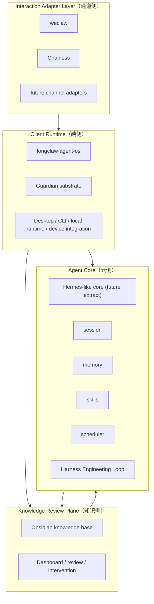
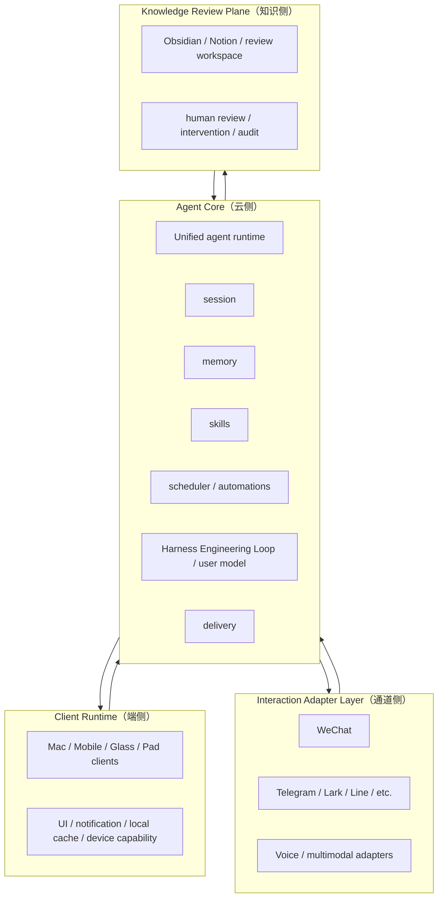

# Longclaw Architecture Plan

This document is the working architecture plan for the Longclaw product line.

It is intentionally more draft-like than the core docs:

- [ARCHITECTURE.md](ARCHITECTURE.md) is the formal architecture definition.
- [REPO_MAP.md](REPO_MAP.md) is the canonical repository classification.
- [ROADMAP.md](ROADMAP.md) is the staged execution path.

Use this file for evolving architecture decisions before they are normalized into the core docs.

## Concept Model

- `Hermes-like Agent Core（云侧）`
  - 目标运行时形态
  - 统一承载 `session / memory / skills / scheduler / user model`
- `Self-improving agent`
  - 产品能力目标
  - 用户感知到的是 agent 会跨会话学习、回忆、改进和贴近个人偏好
- `Harness Engineering Loop`
  - 内部实现机制
  - 负责 ingest、evaluate、regress、promote，并把高风险或冲突内容送到审阅面

三者关系固定为：

- `Hermes-like Agent Core（云侧）` 是架构目标
- `Harness Engineering Loop` 是核心内部闭环
- `Self-improving agent` 是最后呈现出来的产品能力

## Summary

- 统一术语：
  - `Client Runtime（端侧）`
  - `Agent Core（云侧）`
  - `Interaction Adapter Layer（通道侧）`
  - `Knowledge Review Plane（知识侧）`
- 当前阶段目标：把现有系统收敛成稳定的本地参考实现。
- 未来阶段目标：从中抽出可分发的 `Agent Core（云侧）`，最终支持双模并存。
- 设计判断：
  - `hermes-agent` 更偏产品级统一 runtime，适合云上托管和分发。
  - 当前体系更偏端侧参考实现加多仓协作，适合先验证能力和边界。

## Architecture A

### `Local-first Reference Architecture（当前本地参考实现）`

适用原因：

- 现在你主要自用，需要快速闭环。
- 你有本机账号态、微信登录态、`launchd`、本地工具链、桌面通知、语音输入等端侧依赖。
- 这时 `Guardian substrate` 仍然必要，因为你现在不是单一统一 runtime。

优点：

- 最贴近当前现实，迁移成本最低。
- 便于继续跑通 `weclaw / guardian / signals / knowledge base / chanless`。
- 可以逐步抽核心，不会一下打散现有系统。

缺点：

- 端侧逻辑和产品核心仍耦合。
- 仓库边界需要持续整理。
- 不适合作为最终分发架构直接复制给别人。

## Architecture B

### `Distributed Product Architecture（未来产品化架构）`

为什么 `hermes-agent` 更像这一路：

- 它把 CLI、gateway、cron、memory、session search 放进统一 runtime。
- 它更依赖外部托管环境，而不是自己维护一层本地 substrate。
- 因此更适合 VPS、Docker、serverless 和产品分发。

优点：

- 架构最干净，最适合分发。
- `session / memory / skills / scheduler` 天然统一。
- 多端、多通道、多租户更容易扩展。

缺点：

- 对你当前体系重构量大。
- 端侧依赖强的能力要重新切边界。
- `guardian` 这类本地 substrate 要么弱化，要么外包给部署环境。

## Repo Classification

### Primary mapping

- `longclaw-agent-os`
  - 当前归类：`Client Runtime（端侧）`
  - 角色：端侧参考实现、安装升级、launchd/runtime 编排、桌面产品外壳
- `weclaw`
  - 当前归类：`Interaction Adapter Layer（通道侧）`
  - 角色：WeChat bridge core、消息语义、媒体处理、session/media facts、archive contract
- `Chanless`
  - 当前归类：`Interaction Adapter Layer（通道侧）`
  - 角色：语音输入与本地语音调度入口，偏端侧语音 adapter
- `Signals`
  - 当前归类：业务能力域；当前更像 `Agent Core（云侧）` 可调用能力的一部分
  - 角色：金融分析引擎、web/review/backtest/sync、可被 agent 调用的 domain engine
- Obsidian knowledge base
  - 当前归类：`Knowledge Review Plane（知识侧）`
  - 角色：Inbox -> Promote -> Knowledge 的人工审阅与正式知识沉淀层

### Internal sub-systems

- `guardian`
  - 归类：`Client Runtime（端侧）` 内的 substrate
  - 角色：本地 service supervision，不是未来产品核心本身
- `watchdog`
  - 当前建议归类：先留在 `Client Runtime（端侧）`；未来抽进 `Agent Core（云侧）` 的 scheduler/orchestration
- `harness`
  - 当前建议归类：先留在 `Client Runtime（端侧）`；未来拆成 `Agent Core（云侧）` 的 evaluation/feedback 子系统
- `learning runtime`
  - 不建议再作为独立顶层名保留
  - 未来直接归入 `Agent Core（云侧）` 的 `user model + skills + Harness Engineering Loop`

## Recommended Direction

- 近期按 Architecture A 收敛：
  - 把 `longclaw-agent-os` 明确成 `Client Runtime（端侧）` 参考实现。
  - 清理常驻 service，收紧 `guardian / watchdog / harness` 边界。
  - 让知识库继续承担 `Knowledge Review Plane（知识侧）`。
- 中期开始抽 `Agent Core（云侧）`：
  - 第一批抽象对象固定为 `session / memory / skills / scheduler`。
  - `watchdog`、`harness` 的可移植部分进入 `Agent Core（云侧）`。
  - `weclaw`、`chanless` 保持在 `Interaction Adapter Layer（通道侧）`。
- 长期走向 Architecture B：
  - `Client Runtime（端侧）` 变轻。
  - `Agent Core（云侧）` 成为统一产品核心。
  - 支持端侧直连云侧核心，也支持部分轻量本地运行。

## Assumptions

- 当前 `longclaw-agent-os` 不作为最终产品核心仓库，而作为 `Client Runtime（端侧）` 参考实现。
- 未来双模并存，但主抽象方向优先面向 `Agent Core（云侧）`。
- `Signals` 不是基础运行时，而是高价值业务能力域，未来应作为可插拔 domain engine 被核心调用。
- `Knowledge Review Plane（知识侧）` 保持人类可读、可审阅、可回溯，不作为唯一机器状态真源。
