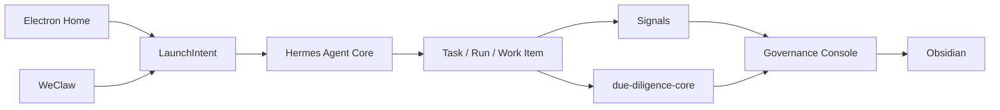

# Longclaw Architecture Plan

This document is the working architecture plan for the Longclaw product line.

It is intentionally more draft-like than the core docs:

- [ARCHITECTURE.md](ARCHITECTURE.md) is the formal architecture definition.
- [REPO_MAP.md](REPO_MAP.md) is the canonical repository classification.
- [ROADMAP.md](ROADMAP.md) is the staged execution path.

Use this file for evolving architecture decisions before they are normalized into the core docs.

## Locked Product Frame

- Longclaw is an Agent OS for a single high-leverage operator.
- It is not a pure governance console.
- It is not a chat-first cowork shell.
- The product rule is:
  - `Chat launches, console governs.`

## Summary

- 统一术语：
  - `Client Runtime（端侧）`
  - `Agent Core（云侧）`
  - `Interaction Adapter Layer（通道侧）`
  - `Capability Substrate`
  - `Professional Grounds`
  - `Reviewed Knowledge Plane`
  - `LaunchIntent`
- 当前阶段目标：把产品结构收敛成 `双前门 + 治理台 + 专业训练场 + reviewed knowledge`。
- 未来阶段目标：抽出更干净的 `Agent Core（云侧）`，但不放弃 `Electron` 作为 default home。

## Product Structure

### `Electron`

`Electron` 是唯一 default home，信息架构固定为：

- `Home`
- `Runs`
- `Work Items`
- `Packs`
- `Studio`

`Home` 取代旧 `Overview`，并固定为：

- `Cowork Launch`
- `Governance Snapshot`

### `WeClaw`

`WeClaw` 是 `remote cowork companion`：

- 发起任务
- 追问状态
- 接收轻量结果
- 触发下一步

但它不是 evidence/review/control-plane UI。

### `Capability Substrate`

位于 `longclaw-agent-os` 的产品能力底座：

- `skills`
- `plugins`
- `bundled skills`
- `built-in plugins`
- `cowork runtime`

`Studio` 只管理 curated capabilities，不把 marketplace 做成主叙事。

### `Professional Grounds`

位于旗舰 pack：

- `Signals`
- `due-diligence-core`

它们不是普通 plugin，也不是第二 home，而是专业深工位。

### `Reviewed Knowledge Plane`

`Obsidian` 只接：

- `reviewed insight`
- stable knowledge cards
- final decisions
- playbooks

它不接 raw chat、raw evidence、delivery fallback noise。

## Canonical Runtime Flow

关键约束：

- `@pack` -> pack run intent
- `@skill` -> workflow or behavior preset
- `@plugin` -> capability bundle or connector preset
- 任何 side-effectful、长时、需要 review、会生成 evidence 的任务，都必须沉淀成 `Run / Artifact / Work Item`

## Architecture Program

### 当前程序

- 保持 `Electron` 为 default home
- 保持 `WeClaw` 为 remote cowork companion
- 用 Hermes 编译 `LaunchIntent`
- 用治理面统一承接 run/artifact/review/work item
- 把 `Signals` 与 `due-diligence-core` 固定成旗舰 `Professional Grounds`

### 中期程序

- 把 `LaunchIntent` 做成正式 canonical 输入
- 把 capability substrate 的 curated set 固化到 `Studio`
- 让治理状态与 reviewed promotion 完整闭环
- 继续收紧 `guardian / watchdog / harness` 边界

### 长期程序

- 抽更薄的 `Client Runtime（端侧）`
- 让 `Agent Core（云侧）` 支撑更多端和通道
- 保持 `Electron` 作为 default home，而不是让所有表面退化成纯 chat

## Draft Decisions To Normalize

- `Overview` 全面替换为 `Home`
- `control plane` 在产品叙事里拆成：
  - `Cowork Front Door`
  - `Governance Console`
- `archive / formal write` 在产品文案里替换成：
  - `reviewed handoff`
  - `promotion`
- `Signals` 与 `due-diligence-core` 统一叫：
  - flagship packs
  - `Professional Grounds`
- `WeClaw` 统一叫：
  - remote cowork companion

## Working Assumptions

- 当前 `longclaw-agent-os` 仍是 `Client Runtime（端侧）` 参考实现，但它已经承担 default home 和 capability substrate host。
- `hermes-agent` 是唯一 `Agent Core（云侧）` 叙事中心。
- `Signals` 不是基础运行时，而是金融专业训练场。
- `due-diligence-core` 不是第二个 core，而是尽调专业训练场和云侧执行 runtime。
- `Obsidian` 只承接 reviewed knowledge，不承接运行态收件箱角色。
